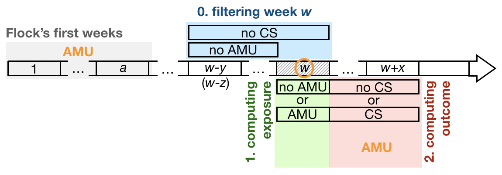

<!--
IMAGES:
Insert them with: 
You can also resize them if needed: convert image.png -resize 50% image.png
If you want to center the image, go through HTML code:
<div style="text-align:center"></div>

REFERENCES:
For references: Put all the bibTeX references in the file "references.bib"
in the current folder and cite the references as @key or [@key] in the text.
Uncomment the bibliography field in the above header and put a "References"
title wherever you want to display the reference list.
-->
<!--
<style type="text/css">
.main-container {
  max-width: 1370px;
  margin-left: auto;
  margin-right: auto;
}
</style>
-->

```{r general options, include = FALSE}
knitr::knit_hooks$set(
  margin = function(before, options, envir) {
    if (before) par(mgp = c(1.5, .5, 0), bty = "n", plt = c(.105, .97, .13, .97))
    else NULL
  },
  prompt = function(before, options, envir) {
    options(prompt = if (options$engine %in% c("sh", "bash")) "$ " else "> ")
  })

knitr::opts_chunk$set(cache = FALSE, autodep = TRUE, message = FALSE, warning = FALSE,
                      dev.args = list(pointsize = 11), fig.height = 3.5,
                      fig.width = 4.24725, fig.retina = 2, fig.align = "center")

options(width = 137)
```

## Introduction

Here we aim at testing whether the prophylactic use of antibiotics (exposure)
has an effect on the occurence of clinical signs (outcome). The main challenge
in this analysis concerns the preparation of the data (essentially in order to
have AMU that can be considered prophylactic) and the overall strategy is
described in **Figure 1**.

<div style="text-align:center">
  
</div>

**Figure 1: Preparation of data before analysis.** The horizontal arrow
represent the time line of a flock, divided into weeks represented by rectangles,
starting on week 1 (on the left). For any given week *w* (represented here by
the hashed rectangle), (i) an exposure variable is computed based on the use or
not of antibiotics (step 1, in green), as well as (ii) an outcome variable based
on the occurence or not of clinical signs over an *observation period* of *x*
weeks after week *w* (step 2, in red). Statistical analyses will consist in
investigating whether AMU on week *w* affects the occurence of clinical signs 
over the observation period. In order to make sure that AMU exposure on week *w*
does correspond to AMU that we can consider as *prophylactic*, we need to filter
out from the analysis all the weeks *w* preceded by (i) the presence of clinical
signs over the *y* weeks before week *w* (including week *w*) and (ii) AMU over
the *z* weeks before week *w* (naturally excluding week *w* since this
information is used to compute the exposure). This step 0 is shown in blue on
the figure. Finally, the analysis may include potential confounding factors
(shown in orange) such as the age of the chicken (i.e. week *w*) as well as AMU
during the first *a* weeks of the flock (in grey) and during the *x* weeks of
the observation period.

Note that the duration *y* over which the filtering based on clinical signs is
done does not have to be equal to the duration *z* over which the filtering
based on AMU is done, although it probably makes sense if they are. On
**Figure 1**, CS corresponds to a given set of clinical signs and AMU and AMU
corresponds to a given set of antimicrobials. Note that the sets of clinical
signs used for the filtering does not have to be identical to the set of
clinical signs used to compute the outcome, although, again, it probably makes
sense if they are. Same remark for the sets of antimicrobials used for the
filtering and the computation of the exposure and the confounding variables over
the first weeks of the flock and the observation period. In the code below, we
create the following 4 functions allowing us to prepare the data according to
the strategy outlined in **Figure 1**:

* `make_exposure(df, antimicrobials)`: computes the exposure variable on week
*w*, using the set of `antimicrobials` antimicrobials.

* `make_outcome(df, outcome, loc, name = "disease")`: computes the outcome
variable of the `loc` weeks that follow week *w* and using the set `outcome` of
clinical signs. `name` is the name that is given to this new variable. Note that
this function will also be used to compute the AMU covariable during the
observation period and `outcome` will then contain the set of antimicrobials to
consider.

* `prophylactic(df, clinical_signs, antimicrobials, lcs, lam)`: performs the
fitering of the week (rows of the data frame `df`), using the set
`clinical_signs` of clinical signs over `lcs` weeks before week *w* and the set
`antimicrobials` of antimicrobials over `lam` weeks before week *w*.

* `first_weeks(df, antimicrobials, wk = 1)`: computes AMU covariable during the
first weeks of the flock, using the set `antimicrobials` of antimicrobials. `wk`
is the duration, in weeks, of this early stage that is considered for the
computation.

In these 4 functions, `df` is a data frame of the structure of viparc data. All
of these functions return the input data frame `df` augmented with the computed
variable. These 4 functions are design so that they assemble perfectly well into
pipelines. Once the data are prepared, the analysis can be performed by
different statistical tests / models:

* the simplest one is certainely a **Fisher exact test**. However, it appears
that both prophylactic AMU and the occurence of clinical signs strongly depends
on the age of the flock (as well as, to a lesser extend, on the AMU during the
first week of the flock and the observation period). For that reason, we
considered more sophisticatted analyses allowing to correct for confounding
effects. These are

* **logistic regression**. Here, we compared correction by partial likelihood
ratio tests and **stratification**. It produces similar results. Because the
effect of age on the occurence of clinical signs may be non-linear we also
considered

* **general additive models** in order to model the age - outcome relationship
in a as flexible way as possible. After the preliminary analyses shown below, it
is this option that we selected for full analysis.

We developped an number of pipelines combining both data preparation and 
data analysis. `pipeline3()` is based on GLM and `pipeline5()` is based on GAM.
`pipeline4()` and `pipeline6()` are the same as `pipeline3()` and `pipeline5()`,
with simplified interfaces. We created 3 functions that allows to explore
relationship in various situations:

* `run_plan(pipeline, df, ...)` runs  the pipeline `pipeline` on the data frame
`df` using the sets of parameters as defined by `...`.

* `develop()` and `simplify()` allows to manipulate the output of `run_plan()`
for better visualization.
  
## Packages

Installing the required packages:

```{r}
required <- c("dplyr", "magrittr", "purrr", "readr")
to_install <- setdiff(required, row.names(installed.packages()))
if (length(to_install)) install.packages(to_install)
```

Loading `magrittr` and `tibble`:

```{r}
library(magrittr)
```

## Loading the data

```{r}
viparc <- readr::read_csv("https://raw.githubusercontent.com/viparc/prophylactic/master/data/viparc_qualitative.csv",
                          col_types = paste(c("cii", rep("l", 51)), collapse = ""))
```

We have 3 types of variables in this data frame:

* week ID with the variables `farm`, `flock` and `week`;
* presence of clinical signs with the variables `respiratory`, `diarrhoea`,
  `cns`, `malaise`, `leg_lesions` and `sudden_death`;
* AMU (presence / absence too) with the `r ncol(viparc) - 9` variables
  `amoxicillin_use` to `unknown_use`.

## Weeks inclusion

The week we are interested in are the weeks for which

* there is no clinical signs during the weeks $w, \dots, w - x$;
* there is no AMU during the weeks $w - 1, \dots, w - y$.

Note here that the first point can apply to any set of clinical signs and that
the second point can apply to any set of antimicrobials. Here, we build the
function `prophylactic()` that performs that filtering. This function makes use
of the function `lagging()` defined below and that lags some variables (defined
in the `var` vector) of a data frame `df` that must have at least 3 columns
named respectively `farm`, `flock` and `week`:

```{r}
lagging <- function(df, var, lag) {
  require(magrittr)                
  stopifnot(c("farm", "flock", "week", var) %in% names(df))
  df %>%
    dplyr::select(!! c("farm", "flock", "week", var)) %>% 
    dplyr::mutate(week = week + lag) %>% 
    dplyr::rename_at(var, paste0, lag)
}
```

Let's try it:

```{r}
lapply(0:2, lagging, df = viparc, var = c("colistin_use", "oxytetracycline_use")) %>% 
  purrr::reduce(dplyr::full_join, c("farm", "flock", "week")) %>% 
  dplyr::left_join(viparc, ., c("farm", "flock", "week")) %>% 
  dplyr::select(farm, flock, week, dplyr::matches("colistin|oxytetracycline"))
```

It works as expected. Now we can define the `prophylactic()` function that uses
the above-defined `lagging()` function:

```{r}
prophylactic <- function(df, clinical_signs, antimicrobials, lcs, lam) {
  require(magrittr)

# stops if there is any missing values among the clinical signs and AMU
# variables (this is a requirement from the lagging() function):
  df %>% 
    dplyr::select(c(clinical_signs, antimicrobials)) %>% 
    anyNA() %>% 
    not() %>% 
    stopifnot()

  week_id <- c("farm", "flock", "week")
  
  purrr::map2(list(c(0, seq_len(lcs)), seq_len(lam)), # doing the lagging on clinical signs and AMU
              list(clinical_signs, antimicrobials),
              ~ purrr::map(.x, lagging, df = df, var = .y)) %>%
    unlist(FALSE) %>% 
    purrr::reduce(dplyr::left_join, week_id) %>% # putting together into a single data frames
    dplyr::select(-week_id) %>% 
    dplyr::mutate_all(dplyr::coalesce, FALSE) %>% # we want to get rid off FALSEs and also NAs
    rowSums() %>%
    not()
}
```

Note that the above pipeline assumes that there is no missing values in the
`clinical_signs` or `antimicrobials` variables. (Hence the `stopifnot()` call at
the beginning of the function.) Indeed, this is a requirement of the use of the
`lagging()` function because this function does add some digit at the end of the
variables names and also adds some missing values. For that reason, we need to
make sure that the original data set does not have these characteristics. Let's
try it:

```{r}
viparc %>% 
  dplyr::mutate(prphlctc = prophylactic(., c("malaise", "diarrhoea"), c("colistin_use", "oxytetracycline_use"), 2, 2)) %>% 
  dplyr::select(farm, flock, week, colistin_use, oxytetracycline_use, malaise, diarrhoea, prphlctc) %>%
  head(20)
```

The filtering can be performed in one step:

```{r}
viparc %>% 
  dplyr::filter(prophylactic(., c("malaise", "diarrhoea"), c("colistin_use", "oxytetracycline_use"), 2, 2))
```

Seems to work as expected. As you can see, `prophylactic()` returns the orginal
data set augmented with a boolean variable named `include` specifying, for each
week, whether it's included in the analysis or not. Next section puts this weeks
selection together with the computations of an exposure and an outcome, by
defining the functions `make_exposure()` and `make_outcome()`.

## Computing clinical signs outcomes

Let's start with the `make_outcome()` function, which is another use of the
`lagging()` function in order to generate the outcome variables in terms of
clinical signs:

```{r}
make_outcome <- function(df, outcome, loc, name = "disease") {
  require(magrittr)
  flock_id <- c("farm", "flock", "week")
  lapply(-seq_len(loc), lagging, df = df, var = outcome) %>% # this is a list of loc slots
    purrr::reduce(dplyr::left_join, flock_id) %>% # puts together into a single data frame
    dplyr::left_join(df, ., flock_id) %>% # merges with original data frame
    dplyr::mutate(!!name := dplyr::select(., dplyr::matches("-\\d+$")) %>%
                              rowSums() %>%
                              as.logical()) %>%
    dplyr::select(-dplyr::matches("\\d+$"))
}
```

where `outcome` is a vector of clinical signs names used to compute the outcome,
`loc` is the duration, in weeks, of the observation period and `name` is the name
of the generated variable. Let's try it:

```{r}
make_outcome(viparc[356:386, ], c("malaise", "diarrhoea"), 2) %>% 
  dplyr::select(farm, flock, week, malaise, diarrhoea, disease)
```

Seems to work as expected. Note again that this function, similarly to the
`prophylactic()` function, returns the original data frame augmented with a
boolean variable of the name specified by `name` specifying whether there is the
presence of the outcome of not. Note also the missing values at the end of the
flocks too. Let's now see the definition of the `make_exposure()` function.

## Computing AMU exposure

The `make_exposure()` function is very simple:

```{r}
make_exposure <- function(df, antimicrobials) {
  dplyr::mutate(df, amu = dplyr::select(df, antimicrobials) %>%
                            rowSums() %>%
                            as.logical())
}
```

Where `antimicrobials` is a vector of antimicrobials names that should be
considered to compute the exposure. Let's try it:

```{r}
make_exposure(viparc, c("colistin_use", "oxytetracycline_use")) %>% 
  dplyr::select(farm, flock, week, colistin_use, oxytetracycline_use, amu)
```

Seems to work as expected. Note again that, similarly to the `prophylactic()`
and `make_outcome()` functions, this function returns the original data frame
augmented with an additional boolean variable `amu` specifying whether there is
AMU exposure or not.

## Optional: covariables

The final statistical analysis can be performed correcting for potential
confounders. Potential confounders that we may want to consider are the AMU
during the first few weeks of the cycle, AMU during the observation period, and
the age of the flock. For the latter one, the variable is simply the week number.
The two other variables are respectively computed by the `first_weeks()` and
`make_outcome()` functions as detailed below.

### AMU during the first week(s)

The following function augmentes the data frame `df` with a boolean variable that
specify whether any of the antimicrobials defined in the `antimicrobials` vector
has been used during the first `wk` weeks:

```{r}
first_weeks <- function(df, antimicrobials, wk = 1) {
  df %>%
    dplyr::filter(week < wk + 1) %>%
    dplyr::group_by(farm, flock) %>% 
    dplyr::group_modify(~ tibble::tibble(amu_first_weeks = any(unlist(.x[, antimicrobials])))) %>% 
    dplyr::ungroup() %>% 
    dplyr::left_join(df, ., c("farm", "flock"))
}
```

Let's try it:

```{r}
viparc %>% 
  first_weeks(c("amoxicillin_use", "ampicillin_use")) %>% 
  dplyr::select(farm, flock, week, amoxicillin_use, ampicillin_use, amu_first_weeks)
```

And with the first 2 weeks:

```{r}
viparc %>% 
  first_weeks(c("amoxicillin_use", "ampicillin_use"), 2) %>% 
  dplyr::select(farm, flock, week, amoxicillin_use, ampicillin_use, amu_first_weeks)
```

Looking at another cycle from another farm:

```{r}
viparc %>% 
  first_weeks(c("amoxicillin_use", "ampicillin_use")) %>% 
  dplyr::select(farm, flock, week, amoxicillin_use, ampicillin_use, amu_first_weeks) %>% 
  dplyr::filter(farm == "75-013")
```

Seems to work as expected.

### AMU over the watching period

If one wants to compute a covariable accounting for AMU during the watching
period, this can simply be done by reusing the `make_outcome()` function defined
above:

```{r}
viparc %>% make_outcome(c("amoxicillin_use", "ampicillin_use"), 2, "amu_observation") %>% 
  dplyr::select(farm, flock, week, amoxicillin_use, ampicillin_use, amu_observation) %>%
  head(20)
```

## Examples of uses

Here we show how to assemble the functions `prophylactic()`, `make_exposure()`,
`make_outcome()` and `first_weeks()` into a pipeline to test a hypothesis.

**WARNING:** in these pipelines, the filtering of the weeks should always be the
last step of the data preparation, just before the statistical analysis.

### Fisher exact test

Simple use of a Fisher exact test, without any co-variable:

```{r}
viparc %>% 
  make_exposure(c("colistin_use", "oxytetracycline_use")) %>% 
  make_outcome(c("malaise", "diarrhoea"), 2) %>% 
  dplyr::filter(prophylactic(., c("malaise", "diarrhoea"),
                             c("colistin_use", "oxytetracycline_use"), 2, 2)) %>%
  # (filtering has to after make_exposure() and make_outcome() calls)
  dplyr::select(amu, disease) %>% 
  na.exclude() %T>% print() %$% # na.exclude() has to be after the selection
  table(amu, disease) %T>% print() %>% 
  fisher.test()
```

### Logistic regression

A logistic regression can equivalently be used:

```{r}
viparc %>% 
  make_exposure(c("colistin_use", "oxytetracycline_use")) %>% 
  make_outcome(c("malaise", "diarrhoea"), 2) %>% 
  dplyr::filter(prophylactic(., c("malaise", "diarrhoea"),
                             c("colistin_use", "oxytetracycline_use"), 2, 2)) %>% 
  dplyr::select(amu, disease) %>% 
  na.exclude() %T>% print() %T>% {with(., table(amu, disease)) %>% print()} %>% 
  glm(disease ~ amu, binomial, .) %>% 
  summary()
```

where the estimate of the coefficient (`amuTRUE`) is the log odds ratio.

### Correcting for potential confounders

In this section we address the problem of confounders and explore on an
example different options to control for them. The best options appears the use
of a GAM.

#### The presence of potential counfounders

Before we start this section, let's define another utilitary function that adds
a vector of suffixes `suff` to a character vector `x` where we want all possible
combinations of `x` and `suff`:

```{r}
add_suffix <- function(x, suff) {
  require(magrittr)
  expand.grid(x, suff) %>%
    purrr::reduce(purrr::map2, paste0) %>%
    unlist()
}
```

Let's try it:

```{r}
add_suffix(letters[1:5], 1:3)
```

Let's now consider the following example:

```{r}
(tmp <- viparc %>% 
  make_exposure(c("colistin_use", "oxytetracycline_use")) %>% 
  make_outcome(c("malaise", "diarrhoea"), 2) %>% 
  first_weeks(c("colistin_use", "oxytetracycline_use")) %>% 
  make_outcome(c("colistin_use", "oxytetracycline_use"), 2, "amu_observation") %>% 
  dplyr::filter(prophylactic(., c("malaise", "diarrhoea"),
                             c("colistin_use", "oxytetracycline_use"), 2, 2)) %>% 
  dplyr::select(amu, disease, week, amu_first_weeks, amu_observation) %>% 
  na.exclude())
```

As we can see below, both exposure (`amu`) and outcome (`disease`) depend on
`week`, `amu_first_weeks` and `amu_observation`:

```{r}
purrr::map(add_suffix(c("amu", "disease"), paste(" ~", c("week", "amu_first_weeks", "amu_observation"))),
    ~ .x %>% 
        formula() %>% 
        glm(binomial, tmp) %>% 
        summary() %>% 
        coef() %>% 
        `[`(2, 4) %>% 
        data.frame(model = .x, p = ., stringsAsFactors = FALSE)) %>% 
  dplyr::bind_rows()
```

These three variables `week`, `amu_first_weeks` and `amu_observation` are thus
potential confounders that need to be corrected for.

#### Correcting for potential confounders

If one wants to consider (and correct for) covariables -- such as age, AMU on
the first week or AMU after the focal week (age of the birds) --, the pipeline
would look as below:

```{r}
tmp %T>% print() %T>% {dplyr::group_by(., amu, disease, amu_first_weeks, amu_observation) %>% dplyr::tally() %>% dplyr::ungroup() %>% print()} %>%  
  glm(disease ~ amu_first_weeks + amu_observation + week + amu, binomial, .) %T>% {summary(.) %>% print()} %>% 
  anova(test = "LRT")
```

**NOTE:** If one wanted to correct for potential farm and / or flock effect,
he'd have to consider mixed effect models (not done here). (Not even sure we
need to do this here.)

Note that accounting for potential confounders makes the effect of the AMU
exposure not significant anymore. Furthermore the estimated odds ratio is now
below 1. Let's try to drop the `week` variable:

```{r}
viparc %>% 
  make_exposure(c("colistin_use", "oxytetracycline_use")) %>% 
  make_outcome(c("malaise", "diarrhoea"), 2) %>% 
  first_weeks(c("colistin_use", "oxytetracycline_use")) %>% 
  make_outcome(c("colistin_use", "oxytetracycline_use"), 2, "amu_observation") %>% 
  dplyr::filter(prophylactic(., c("malaise", "diarrhoea"),
                             c("colistin_use", "oxytetracycline_use"), 2, 2)) %>% 
  dplyr::select(amu, disease, amu_first_weeks, amu_observation) %>% 
  na.exclude() %>%  
  glm(disease ~ amu_first_weeks + amu_observation + amu, binomial, .) %T>% {summary(.) %>% print()} %>% 
  anova(test = "LRT")
```

which suggest that the `week` variable (i.e. the age of the flock) is really the
variable that causes the spurious relationship between prophylactic use (`amu`)
and occurence of infection (`disease`). Let's try again with `week` but this
time also including interaction with `amu`:

```{r}
anova(glm(disease ~ amu_first_weeks + amu_observation + week * amu, binomial, tmp), test = "LRT")
```

It doesn't really help. Let's try modeling the age effect in a more flexible way
than a linear relationship, using GAM:

```{r}
summary(mgcv::gam(disease ~ amu_first_weeks + amu_observation + s(week) + amu, binomial, tmp))
```

Not better. Let's try to stratify. For example, under the age of 6 weeks there
seems to have not much effect of `week`, `amu_first_weeks` and `amu_observation`.
See. Let's consider for that this data set:

```{r}
tmp2 <- viparc %>% 
  make_exposure(c("colistin_use", "oxytetracycline_use")) %>% 
  make_outcome(c("malaise", "diarrhoea"), 2) %>% 
  first_weeks(c("colistin_use", "oxytetracycline_use")) %>% 
  make_outcome(c("colistin_use", "oxytetracycline_use"), 2, "amu_observation") %>% 
  dplyr::filter(prophylactic(., c("malaise", "diarrhoea"),
                             c("colistin_use", "oxytetracycline_use"), 2, 2))
```

Look at the significativity of the confounders for the 1-5-week age strata:

```{r}
tmp2 %>% 
  dplyr::filter(week < 6) %>% 
  dplyr::select(amu, disease, week, amu_first_weeks, amu_observation) %>% 
  na.exclude() %>%  
  glm(disease ~ amu_first_weeks + amu_observation + week + amu, binomial, .) %>% 
  anova(test = "LRT")
```

and for the 1-6-week age strata:

```{r}
tmp2 %>% 
  dplyr::filter(week < 7) %>% 
  dplyr::select(amu, disease, week, amu_first_weeks, amu_observation) %>% 
  na.exclude() %>%  
  glm(disease ~ amu_first_weeks + amu_observation + week + amu, binomial, .) %>% 
  anova(test = "LRT")
```

Let's thus consider the 6-weeks threshold and investigate the relationship
between `disease` and `amu`:

```{r}
tmp2 %>% 
  dplyr::filter(week < 6) %>% 
  dplyr::select(amu, disease) %>% 
  na.exclude() %>%  
  glm(disease ~ amu, binomial, .) %>% 
  anova(test = "LRT")
```

No significant relationship between prophylaxy and disease occurence in the
1-to-6-week age band.

## Pipelines

### Using the Fisher exact test

Let's redefine a Fisher exact test function that returns the results of the test
together with the input contingency table:

```{r}
fisher_test <- function(x, ...) {
  list(x, fisher.test(x, ...))
}
```

Let's define a first pipeline using this new function:

```{r}
pipeline1 <- function(df, clinical_signs_filtering = NULL, antimicrobials_filtering = NULL, lcs,
                      lam, antimicrobials_input = NULL, clinical_signs_output = NULL, watching, ...) {
  require(magrittr)
  var_names <- setdiff(names(df), c("farm", "flock", "week"))
  cs_names <- grep("_use$", var_names, value = TRUE, invert = TRUE)
  am_names <- grep("_use$", var_names, value = TRUE)
  if (is.null(clinical_signs_filtering)) clinical_signs_filtering <- cs_names
  if (is.null(clinical_signs_output)) clinical_signs_output <- cs_names
  if (is.null(antimicrobials_filtering)) antimicrobials_filtering <- am_names
  if (is.null(antimicrobials_input)) antimicrobials_input <- am_names
  df %>% 
    make_exposure(antimicrobials_input) %>% # creates amu variable
    make_outcome(clinical_signs_output, watching, "disease") %>% # creates disease variable
    dplyr::filter(prophylactic(., clinical_signs_filtering, antimicrobials_filtering, lcs, lam)) %>% 
    dplyr::select(amu, disease) %>% 
    na.exclude() %$%
    table(amu, disease) %>% 
    fisher_test(., ...)
}
```

Let's try it:

```{r}
pipeline1(viparc,
# 1. FILTERING -----------------------------------------------------------------
          clinical_signs_filtering = c("malaise", "diarrhoea"),
          antimicrobials_filtering = c("colistin_use", "oxytetracycline_use"),
          lcs = 2, # the duration over which we perform the filtering on clinical signs
          lam = 2, # the duration over which we perform the filtering on antimicrobials use
# 2. INPUT ---------------------------------------------------------------------
          antimicrobials_input = c("colistin_use", "oxytetracycline_use"),
# 3. OUTPUT --------------------------------------------------------------------
          clinical_signs_output = c("malaise", "diarrhoea"),
          watching = 2) # the duration of the observation period
```

Note that

* the durations over which the filterings on clinical signs (`lcs`) and
  antimicrobials use (`lam`) do not have to be identical (even though it doesn't
  really make much sense if they are not);
  
* the sets of clinical signs used for filtering (`clinical_signs_filtering`) and
  the computation of the output (`clinical_signs_output`) do not need to be
  identical (even though it doesn't really make much sense if they are not);
  
* the sets of antimicrobials used for filtering (`antimicrobials_filtering`) and
  the computation of the input (`antimicrobials_input`) do not need to be
  identical (even though it doesn't really make much sense if they are not);
  
* the duration of observation (`watching`) of course is totally independent of
  the durations over which the filtering is performed (`lcs` and `lam`).

Taking into account these above remarks, a simplified version of `pipeline1()`
could be:

```{r}
pipeline2 <- function(df, clinical_signs = NULL, antimicrobials = NULL, filtering, watching, ...)
  pipeline1(df, clinical_signs, antimicrobials, filtering, filtering, antimicrobials, clinical_signs, watching, ...)
```

And a call of this function would look like:

```{r}
a <- pipeline2(viparc,
# 1. DEFINING THE CLINICAL SIGNS WE CONSIDER -----------------------------------
          clinical_signs = c("malaise", "diarrhoea"),
# 2. DEFINING THE ANTIMICROBIALS USAGES WE CONSIDER ----------------------------
          antimicrobials = c("colistin_use", "oxytetracycline_use"),
# 3. THE DURATION OF THE PERIOD BEFORE THE FOCAL WEEK OVER WHICH WE DO THE FILTERING
          filtering = 2,
# 4. THE DURATION OF THE PERIOD AFTER THE FOCAL WEEK OVER WHICH WE OBSERVE -----
          watching = 2)
```

Let's explore the structure of the produced object:

```{r}
str(a)
```

Thanks to `pipeline2()`, it's very easy to explore different options for the
analysis. For example, let's compare this

```{r}
pipeline2(viparc,
# 1. DEFINING THE CLINICAL SIGNS WE CONSIDER -----------------------------------
          clinical_signs = c("malaise", "diarrhoea"),
# 2. DEFINING THE ANTIMICROBIALS USAGES WE CONSIDER ----------------------------
          antimicrobials = c("colistin_use", "oxytetracycline_use"),
# 3. THE DURATION OF THE PERIOD BEFORE THE FOCAL WEEK OVER WHICH WE DO THE FILTERING
          filtering = 2,
# 4. THE DURATION OF THE PERIOD AFTER THE FOCAL WEEK OVER WHICH WE OBSERVE -----
          watching = 2)
```

with this:

```{r}
pipeline2(viparc,
# 1. DEFINING THE CLINICAL SIGNS WE CONSIDER -----------------------------------
          clinical_signs = c("malaise", "diarrhoea", "respiratory"),
# 2. DEFINING THE ANTIMICROBIALS USAGES WE CONSIDER ----------------------------
          antimicrobials = c("colistin_use", "oxytetracycline_use"),
# 3. THE DURATION OF THE PERIOD BEFORE THE FOCAL WEEK OVER WHICH WE DO THE FILTERING
          filtering = 2,
# 4. THE DURATION OF THE PERIOD AFTER THE FOCAL WEEK OVER WHICH WE OBSERVE -----
          watching = 2)
```

If you want all the clinical signs and all the antimicrobials:

```{r}
pipeline2(viparc, filtering = 2, watching = 2)
```

### Using logistic regression with covariables

We can use similar rationale in order to define pipeline functions that perform
logistic regression with covariables:

```{r}
pipeline3 <- function(df, clinical_signs_filtering = NULL, antimicrobials_filtering = NULL, lcs,
                      lam, antimicrobials_input = NULL, clinical_signs_output = NULL, watching,
                      antimicrobials_week1 = NULL, wk, antimicrobials_watching = NULL) {
  require(magrittr)
  var_names <- setdiff(names(df), c("farm", "flock", "week"))
  cs_names <- grep("_use$", var_names, value = TRUE, invert = TRUE)
  am_names <- grep("_use$", var_names, value = TRUE)
  if (is.null(clinical_signs_filtering)) clinical_signs_filtering <- cs_names
  if (is.null(clinical_signs_output)) clinical_signs_output <- cs_names
  if (is.null(antimicrobials_filtering)) antimicrobials_filtering <- am_names
  if (is.null(antimicrobials_input)) antimicrobials_input <- am_names
  if (is.null(antimicrobials_week1)) antimicrobials_week1 <- am_names
  if (is.null(antimicrobials_watching)) antimicrobials_watching <- am_names
  df %>% 
    make_exposure(antimicrobials_input) %>% 
    make_outcome(clinical_signs_output, watching) %>% 
    first_weeks(antimicrobials_week1, wk) %>% 
    make_outcome(antimicrobials_watching, watching, "amu_observation") %>% 
    dplyr::filter(prophylactic(., clinical_signs_filtering, antimicrobials_filtering, lcs, lam)) %>% 
    dplyr::select(farm, flock, week, amu_first_weeks, amu_observation, amu, disease) %>% 
    na.exclude() %>% 
    glm(disease ~ amu_first_weeks + amu_observation + week + amu, binomial, .)
}
```

A wrapper with reduce flexibility in the interface:

```{r}
pipeline4 <- function(df, clinical_signs = NULL, antimicrobials = NULL, filtering, watching, first_wks)
  pipeline3(df, clinical_signs, antimicrobials, filtering, filtering, antimicrobials, clinical_signs, watching, antimicrobials, first_wks, antimicrobials)
```

Let's try it:

```{r}
pipeline4(viparc, filtering = 2, watching = 2, first_wks = 1) %T>% 
  {summary(.) %>% print()} %>% 
  anova(test = "LRT")
```

### Using GAM with covariables

Same thing as above but using a GAM instead of a GLM.:

```{r}
pipeline5 <- function(df, clinical_signs_filtering = NULL, antimicrobials_filtering = NULL, lcs,
                      lam, antimicrobials_input = NULL, clinical_signs_output = NULL, watching,
                      antimicrobials_week1 = NULL, wk, antimicrobials_watching = NULL) {
  require(magrittr)
  var_names <- setdiff(names(df), c("farm", "flock", "week"))
  cs_names <- grep("_use$", var_names, value = TRUE, invert = TRUE)
  am_names <- grep("_use$", var_names, value = TRUE)
  if (is.null(clinical_signs_filtering)) clinical_signs_filtering <- cs_names
  if (is.null(clinical_signs_output)) clinical_signs_output <- cs_names
  if (is.null(antimicrobials_filtering)) antimicrobials_filtering <- am_names
  if (is.null(antimicrobials_input)) antimicrobials_input <- am_names
  if (is.null(antimicrobials_week1)) antimicrobials_week1 <- am_names
  if (is.null(antimicrobials_watching)) antimicrobials_watching <- am_names
  df %>% 
    make_exposure(antimicrobials_input) %>% 
    make_outcome(clinical_signs_output, watching) %>% 
    first_weeks(antimicrobials_week1, wk) %>% 
    make_outcome(antimicrobials_watching, watching, "amu_observation") %>% 
    dplyr::filter(prophylactic(., clinical_signs_filtering, antimicrobials_filtering, lcs, lam)) %>% 
    dplyr::select(farm, flock, week, amu_first_weeks, amu_observation, amu, disease) %>% 
    na.exclude() %>% 
    mgcv::gam(disease ~ amu_first_weeks + amu_observation + s(week) + amu, binomial, .)
}
```

And the wrapper with the simple interface:

```{r}
pipeline6 <- function(df, clinical_signs = NULL, antimicrobials = NULL, filtering, watching, first_wks)
  pipeline5(df, clinical_signs, antimicrobials, filtering, filtering, antimicrobials, clinical_signs, watching, antimicrobials, first_wks, antimicrobials)
```

Let's try it:

```{r}
pipeline6(viparc, filtering = 2, watching = 2, first_wks = 1) %>% 
  summary()
```

## Exploring the effects of durations

### With GLM

Let's define an S3 generic function that extracts all the information that we
are interested in from the output of an object of class `glm` or `mgcv`:

```{r}
get_outputs <- function (x, ...) {
   UseMethod("get_outputs", x)
 }
```

Let's now define a `glm` method for that generic:

```{r}
get_outputs.glm <- function(x) {
  data <- x$model
  m <- with(data, table(amu, disease))
  list(n    = nrow(data),
       ct   = addmargins(m),
       prob = round(sweep(m, 1, rowSums(m), "/"), 2),
       or   = exp(tail(coef(x), 1)),
       p    = tail(anova(x, test = "LRT")$`Pr(>Chi)`, 1))
}
```

Let's try it:

```{r}
get_outputs(pipeline4(viparc, filtering = 2, watching = 2, first_wks = 1))
```

Let's now run it on a batch of durations values:

```{r}
expand.grid(filtering = 1:2, watching = 1:2, first_wks = 1:2) %>% 
  purrr::pmap(pipeline4, df = viparc) %>% 
  lapply(get_outputs)
```

### With GAM

Let's now define a `gam` method for the `get_outputs()` generic:

```{r}
get_outputs.gam <- function(x) {
  data <- x$model
  m <- with(data, table(amu, disease))
  summ <- summary(x)
  list(n    = nrow(data),
       ct   = addmargins(m),
       prob = round(sweep(m, 1, rowSums(m), "/"), 2),
       or   = unname(exp(tail(summ$p.coef, 1))),
       p    = unname(tail(summ$p.pv, 1)))
}
```

Let's try it:

```{r}
get_outputs(pipeline6(viparc, filtering = 2, watching = 2, first_wks = 1))
```

Let's now run it on a batch of durations values, and put the output in shape:

```{r}
(tmp <- expand.grid(filtering = 1:2, watching = 1:2, first_wks = 1:2) %>% 
  tibble::as_tibble() %>%
  assign("plan", ., 1) %>% # saving intermediate value
  purrr::pmap(pipeline6, df = viparc) %>% 
  lapply(get_outputs) %>% 
  purrr::transpose() %>%
  tibble::as_tibble() %>% 
  dplyr::mutate_at(c("n", "or", "p"), unlist) %>% 
  dplyr::bind_cols(plan, .)) # intermediate value re-used here
```

Let's make a function out of this above code:

```{r}
run_plan <- function(f, df, clinical_signs = NULL, antimicrobials = NULL, filtering = 1, watching = 1, first_wks = 1) {
  require(magrittr)
  
  var_names <- setdiff(names(df), c("farm", "flock", "week"))
  if (is.null(antimicrobials)) antimicrobials <- list(grep("_use$", var_names, value = TRUE))
  else if (! is.list(antimicrobials)) antimicrobials <- list(antimicrobials)
  if (is.null(clinical_signs)) clinical_signs <- list(grep("_use$", var_names, value = TRUE, invert = TRUE))
  else if (! is.list(clinical_signs)) clinical_signs <- list(clinical_signs)
  
  environment() %>% 
    as.list() %>% 
    `[<-`(c("f", "df", "var_names"), NULL) %>% 
    expand.grid() %>% 
    tibble::as_tibble() %>%
    assign("plan", ., 1) %>% # saving intermediate value
    purrr::pmap(f, df = df) %>%
    lapply(get_outputs) %>%
    purrr::transpose() %>%
    tibble::as_tibble() %>%
    dplyr::mutate_at(c("n", "or", "p"), unlist) %>%
    dplyr::bind_cols(plan, .) # reusing the intermediate value
}
```

Let's also write two function that will help the visualization of the output of
the `run_plan()` function. The first one develops the list of clinical signs and
/ or antimicrobials so that they can easily be read in the data frame:

```{r}
develop <- function(df, var = NULL) {
  names_df <- names(df)
  var_ref <- c("clinical_signs", "antimicrobials")
  if (is.null(var)) var <- intersect(names_df, var_ref)
  stopifnot(var %in% names_df)
  stopifnot(var %in% var_ref)
  dplyr::mutate_at(df, var, ~ sapply(., paste, collapse = ", "))
}
```

The second one remove the columns that contain no variability:

```{r}
simplify <- function(df) {
  df[, sapply(df, function(x) length(unique(x))) > 1]
}
```

Let's now try these three functions. With default values:

```{r}
run_plan(pipeline6, viparc)
```

By default, the set of all clinical signs and the set of all antimicrobials are
considered, and the durations of the begining of the flock, the filtering period,
and the observation period are fixed to 1 week. This can be changed by assigning
values to the arguments of the `run_plan()` function. For example, considering 2
different durations of the filtering period:

```{r}
(tmp <- run_plan(pipeline6, viparc, filtering = 1:2))
```

Note that you can access the cotingency tables this way:

```{r}
tmp$ct
```

Access to the probabilities would be done the same way:

```{r}
tmp$prob
```

and same thing for the list of clinical signs and antimicrobials. If you want to
see only the columns for which values change:

```{r}
simplify(tmp)
```

Let's see a more complex example:

```{r}
(tmp <- run_plan(pipeline6, viparc, filtering = 1:2, watching = 1:2,
                 antimicrobials = list("colistin_use", c("colistin_use", "cefotaxime_use")),
                 clinical_signs = "respiratory", first_wks = 1))
```

This output can be visualized with the `simplify()` function:

```{r}
simplify(tmp)
```

the `develop()` function:

```{r}
develop(tmp)
```

or the two in combination:

```{r}
simplify(develop(tmp))
```

which is equivalent to:

```{r}
develop(simplify(tmp))
```

